# 基础使用-组操作

{:toc}

​		在配置大屏的过程中，随着元件越来越多，我们的管理会越来越费力。所以我们需要将多个位置相近或属性相似的组件聚合到一起，成为一个“组”，便于管理。下图是两个指标翻牌器组件组成的组。

- 虚线边框是组的边界。
- 实线边框是组内组件的边界。
- 边框左上角代表元素坐标。若元素在组中，则元素坐标为组内坐标，也就是以组的左上角为原点的相对位置。（当元素不在任何组内时，它属于“背景画布”组）

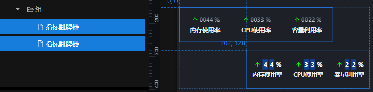

## 一，初始化组

### 1，成组&解组

- 成组

  按住ctrl，在左侧单击选择所有想要成一组的元素。放开ctrl，单击“成组”按钮。

  

- 解组

  选中一个组，单击“取消成组”按钮。

  

### 2，元素 加入组&脱离组

- 加入组，在左侧图层栏，将元素拖入组中即可。

- 脱离组，在左侧图层栏，将元素拖出组即可。

​		**注意**：当我们改变元素的层级(加入/脱离组)后，元素的位置可能会发生变化。

​		这是由于元素的位置代表组内相对位置。在改变层级后，该值不会改变，但归属的组可能在另一个位置，所以该元素绝对位置也会改变。

## 二，控制组尺寸

​		组尺寸设置不当，可能导致如下问题。

- 当我们使用轮播功能时，组件/组尺寸可能会影响到轮播组件的位置。
- 如果组尺寸过大，可能会对其它带有交互的组件产生遮挡。

​		本节将说明如何控制组尺寸。

### 1，组的位置

​		组的位置可通过配置栏调整，也可以在画布或者图层栏选中组，通过鼠标拖拽完成。

### 2，组尺寸

组的高 = 组内所有组件上下边界极值差值

组的宽 = 组内所有组件左右边界极值差值

#### 1  影响组尺寸的因素

##### 1.1 在图上拖动调整组大小

 在平台中，如果想直接调整组的大小，唯一的方法是直接在图上拖动改变，但这样会导致组内所有组件比例的变化。以下是拖动前和拖动后的对比图。

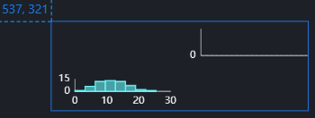

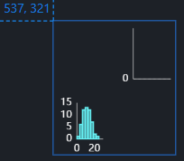

##### 1.2 移动组内组件导致组尺寸变化

​		在平台中，组件的位置就是组件在组中的相对位置（当组件不处于任何组时，它属于背景画布组，本文不讨论）。当我们输入数值设置组件位置时，下列两种情况都**可能**导致组大小和位置的变化。

 1，组件移动后，组件范围超出组范围。

 2，组件移动前，仅该组件处于组边界。组件向内移动。

 例：下两图是组件移动前后坐标对比。符合第 2 点。

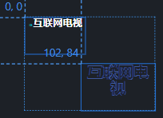

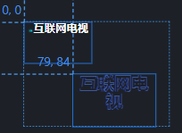

 其它的情况**均不会**导致组大小和位置的变化。

#### 2  控制组尺寸的方法

 我们可以通过合理设置组内组件的位置，来控制组尺寸。移动组件有两种方式：直接拖动和输入数值。

 1，拖动移动组件，移动后的组件符合上述情况时，组的大小**一定**会被改变。不再详述。

 2，输入数值移动组件，**可能**会导致组的大小变化。下面我们来说具体的控制方法。

##### 2.1 改变组尺寸

 在输入数值后，我们在左侧导航栏点击组内其它组件即可。系统会自动更新组内所有组件的相对位置和组的大小。以下是移动前和移动后的对比。

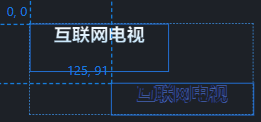

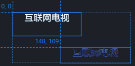

 如果我们的移动使组左边界或上边界发生改变，则组的位置也会改变。如下例。

 在移动前，组边界坐标如下图所示。

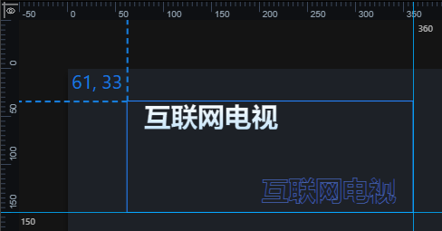

 我们将左上的组件向左上移动，发现组的大小和坐标也会改变，但右边界和下边界不变。效果如下图所示。

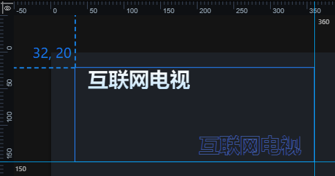

##### 2.2 不改变组尺寸

 在输入组内元素新坐标的数值后，我们在左侧导航栏点击组即可。效果如下图所示。

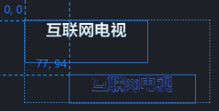

 如果想将组件移出边界，也是一样的操作。效果如下图所示。

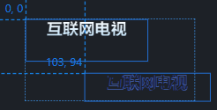

 我们也可以将组内的组件位置设置为负数。此时组的位置和大小都不会改变。效果如下图所示。

## 三、轮播功能

​		轮播功能可以让多个元素显示在同一区域，并轮流展示。

### 1，基础配置项

| 配置项        | 说明                           |
| ------------- | ------------------------------ |
| 使用权限      | 使用权限接口对轮播功能初始化   |
| 水平/垂直对齐 | 轮播元素水平/垂直对齐方式      |
| 自动轮播      | 元素是否自动轮播               |
| 轮播速度      | 元素轮播的周期，单位是毫秒     |
| 动画          | 有两种轮播动画，滑动/渐显渐隐  |
| 动画时长      | 元素轮播动画的时长，单位是毫秒 |
| 缓动效果      | 动画的详细快慢效果             |

​		对于显示的元素，除了轮播切换，我们也可以通过单击进行切换。平台提供两种切换方式。

- 轮播箭头

  在轮播组的左右两侧显示切换箭头，我们可以使用默认箭头样式，也可以自定义图片当成切换图标。

- 控制点

  在组的周围显示控制点，我们可以通过点击，显示相应的元素。控制点的个数由元素决定。我们可以对其进行配置。

  | 配置项       | 说明                         |
  | ------------ | ---------------------------- |
  | width/height | 控制点圆点的长度/宽度        |
  | left/top     | 控制点的相对位置，可以为负值 |
  | 布局         | 控制点按水平/垂直排列        |
  | 颜色         | 控制点的颜色                 |

  除了常规按钮，我们也可以自定义控制点的样式。如下图，我们可以设置文字基础属性、背景图片、控制点间距等。

  

  控制点一般可以使用TAB列表进行替代。

### 2，通过外部组件控制轮播元素

​		如果我们想通过外部组件控制显示轮播组内的某个元素，则外部组件必须具备派发参数的能力(交互事件>>派发参数)。外部组件派发参数，轮播组接收参数，并显示相应的元素。

​		参数传递的过程，就是发送参数的组件像平台中发送参数。当平台检测到有参数时，会找到接收此参数的元素，并触发相应操作。

- 轮播组接收参数

  我们可以在交互栏中设置接收的参数(字段)。如下图，当平台检测到“a”参数时，便会激活这个组的交互。

  

  注意，接收参数时，我们需要在参数前加上冒号“:”，以便和发送参数做区分。

- 外部组件发送参数

  不同的组件，可能会有不同的交互栏。下面分别是TAB列表(tab-list)和单张图片(single-image)的交互栏配置项。

  

  

​		那我们如何知道单击外部组件时，轮播组显示的是哪个元素呢？我们可以给轮播组中的每个组件配置id，外部组件可以通过传递此id，控制显示或隐藏相应组件。例如轮播组内有三个组件，我们可以给三个组件依次设置id为1、2、3。如下图。

​		此时我们可以设置外部组件发送id，来控制显示的组件。例如单张图片(single-image)中的设置，如下图。

​		这样，当我们单击图片的时候，轮播组就会显示id为1的元素。在上例中就是组中的第一个元素。

​		有些组件不能像单张图片一样发送参数。例如TAB列表(tab-list)，它默认发送的参数就是1、2、3......，不可自定义。